# Multi-species ecosystems

$\\$

Riz Fernando Noronha

---

### Predator-Prey Models

$\\$

$$
\begin{align}
\frac{\mathrm{d}x}{\mathrm{d}t} &= \alpha x - \beta xy \\
\frac{\mathrm{d}y}{\mathrm{d}t} &= \delta xy - \gamma y
\end{align}
$$

---

### How do we model many species??

$\\$

Every species (possibly) interacts with every other species

$N$ species implies $\sim N^2$ interactions!!

---

### Random Matrix Models

Each species can consume every other species.

The rate at which species $i$ consumes species $j$ is given by $J_{ij}$

$J$ is a matrix with random (uniform) entries

---

### On a lattice?

$\\$

Done in a simple, elegant way!

---

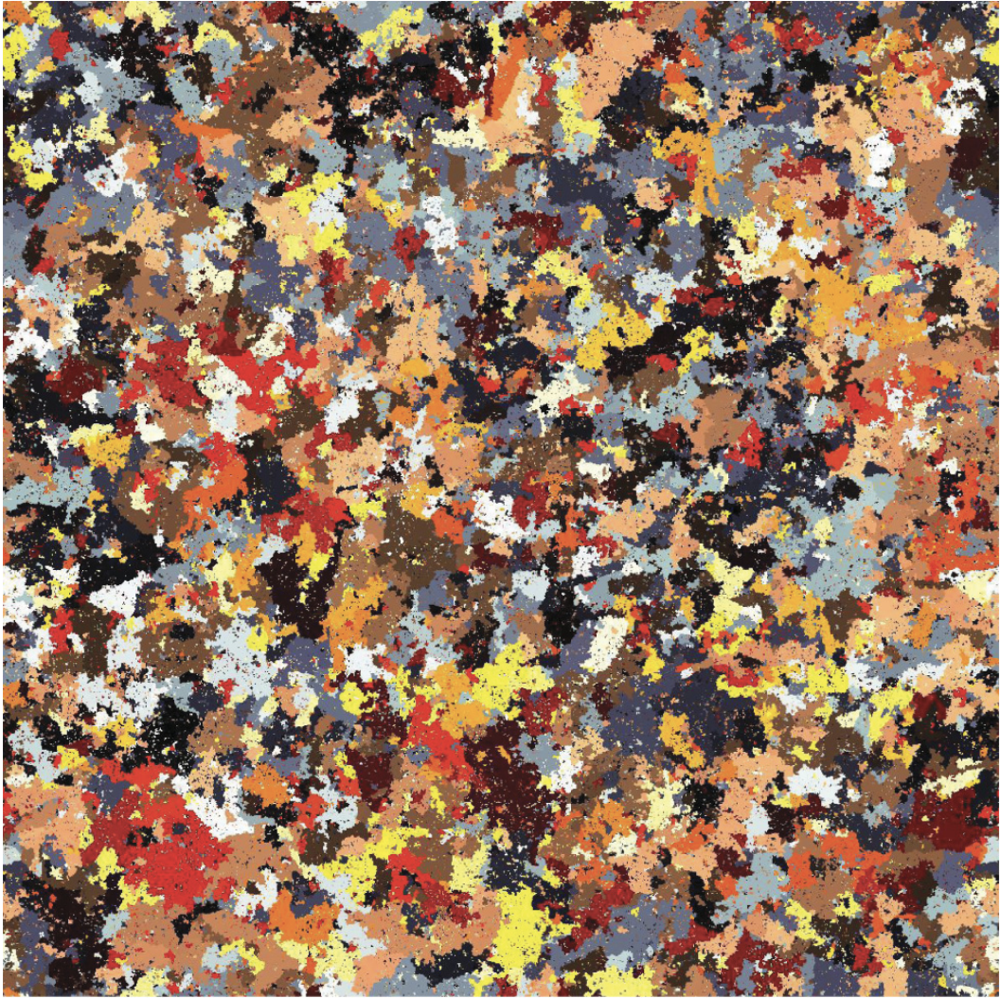

#### Lichen Model

2011

Introduce **new species** at a fixed rate

---

### On the Micro-scale?

<video src="fig/t6ss_vibriocyclitrophicus_ordalii.mp4" autoplay muted loop></video>

- Type 6 Secretion System (**T6SS**)

- Vibrio cyclitrophicus

- Vibrio ordalii

- Damages cell membrane (becomes circular)

---

### Real Microbial Communities

$\\$

T6SS is relatively **uncommon**

Microbes interact through chemicals

**Secretion** and **uptake**

---

### Consumption $\rightarrow$ Catalysis

$\\$

- Every species has it's own chemical

- Species $i$ constantly produces chemical $i$ 

- Species $i$ reproduces with chemical $j$ at rate $J_{ij}$

---

### Mean-Field Equations

$$
\begin{align}
\frac{\mathrm{d}\color{darkgreen}{O_1}}{\mathrm{d}t} &= J_{\color{darkgreen}{1}\color{green}{1}}\color{darkgreen}{O_1}\color{green}{N_1} \color{black}{+} J_{\color{darkgreen}{1}\color{blue}{2}}\color{darkgreen}{O_1}\color{blue}{N_2}  \color{black}{- \theta} \color{darkgreen}{O_1} \\
\frac{\mathrm{d}\color{darkblue}{O_2}}{\mathrm{d}t} &= J_{\color{darkblue}{2}\color{green}{1}}\color{darkblue}{O_2}\color{green}{N_1} \color{black}{+} J_{\color{darkblue}{2}\color{blue}{2}}\color{darkblue}{O_2}\color{blue}{N_2}  \color{black}{- \theta} \color{darkblue}{O_2} \\
\frac{\mathrm{d}\color{green}{N_1}}{\mathrm{d}t} &= \color{black}{\theta} \color{darkgreen}{O_1} \color{black}{+ (1-} J_{\color{darkgreen}{1}\color{green}{1}} \color{black}{)} \color{darkgreen}{O_1}\color{green}{N_1} \color{black}{+ (1-} J_{\color{darkgreen}{1}\color{blue}{2}} \color{black}{)} \color{darkgreen}{O_1}\color{blue}{N_2} \color{black}{-} \color{darkgreen}{O_1}\color{green}{N_1} \color{black}{-} \color{darkblue}{O_2}\color{green}{N_1} \\
\frac{\mathrm{d}\color{blue}{N_2}}{\mathrm{d}t} &= \color{black}{\theta} \color{darkblue}{O_2} \color{black}{+ (1-} J_{\color{darkblue}{2}\color{green}{1}} \color{black}{)} \color{darkblue}{O_2}\color{green}{N_1} \color{black}{+ (1-} J_{\color{darkblue}{2}\color{blue}{2}} \color{black}{)} \color{darkblue}{O_2}\color{blue}{N_2} \color{black}{-} \color{darkgreen}{O_1}\color{blue}{N_2} \color{black}{-} \color{darkblue}{O_2}\color{blue}{N_2}
\end{align}
$$

---

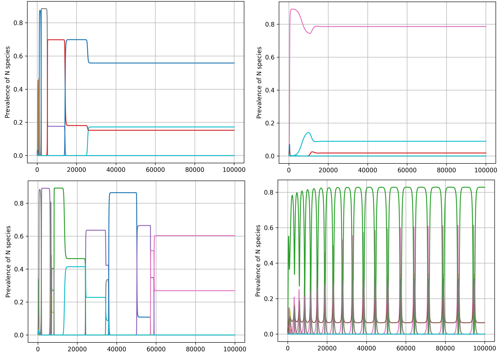

---

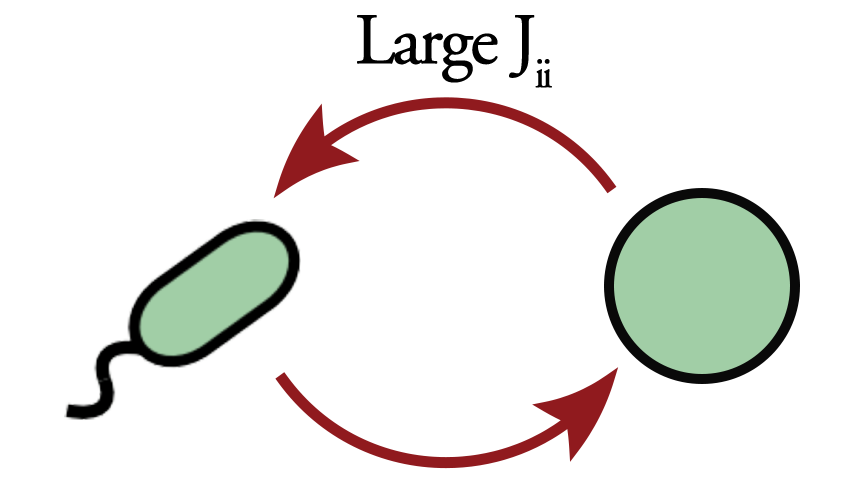

Switching is **interesting**, but self-interactions?

Turn off the diagonal!

$$ J_{ii} = 0 \quad \forall \;i $$

---

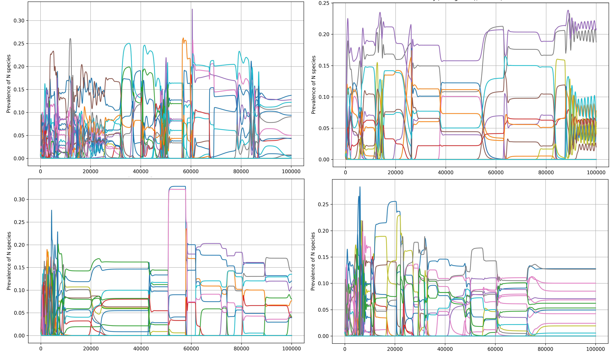

---

<video src="fig/lattice_anim_N_50_theta_0.1_1.mp4" autoplay muted loop style="max-width:100%;"></video>

### Lattice model
 

- Spatial patterning present

- Invasion between ecosystems?

---

**More species survive!**

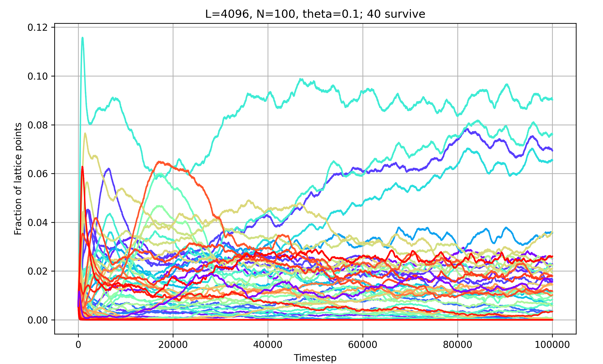

---

### 'Problem' 1: Long-Term Stability

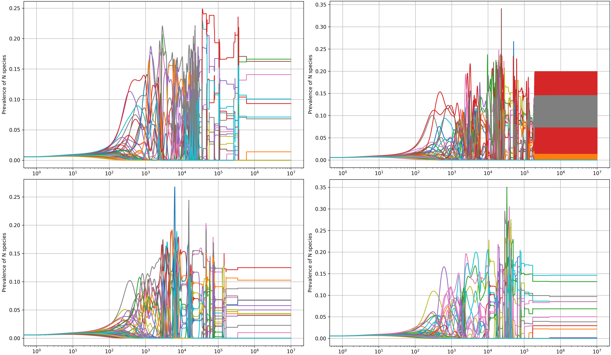

---

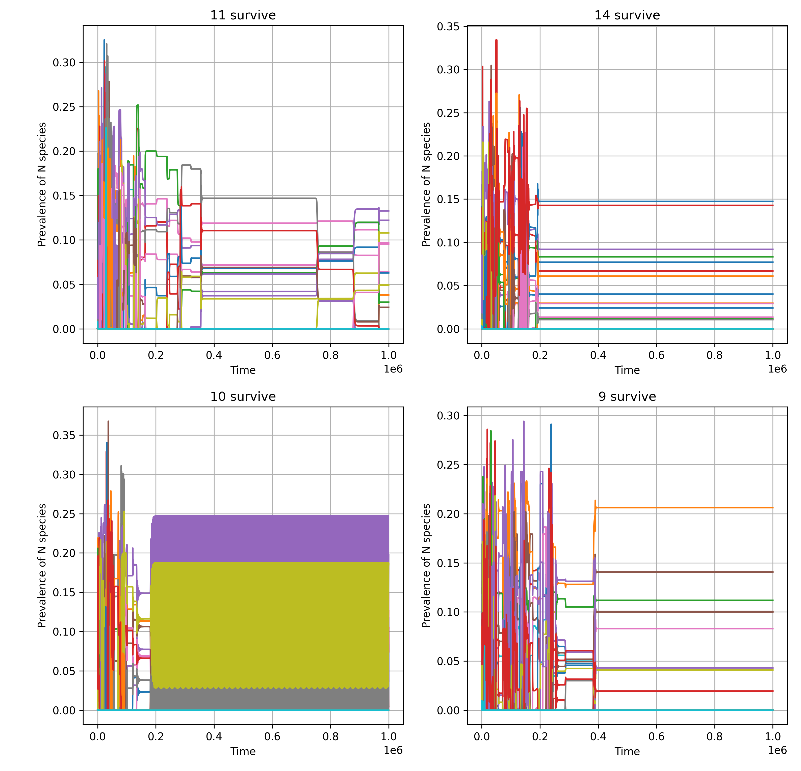

Same $J$ matrix, different ICs

$\\$

**Different Final States!**

$\\$
1. Life is transient
2. Add noise

---

### Problem 2: King Midas

<video src="fig/midas.mp4" autoplay muted loop style="max-width:100%;"></video>

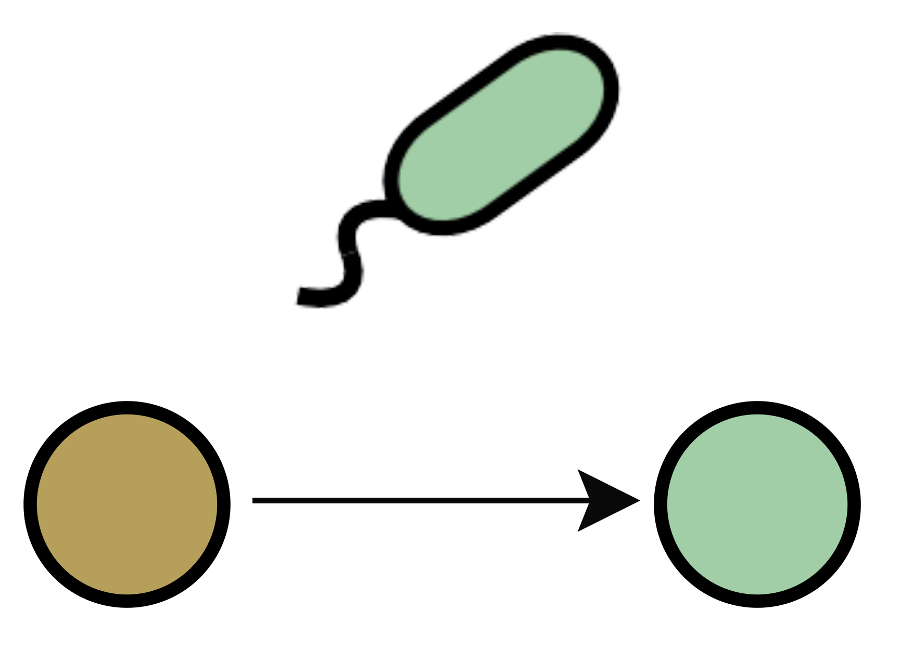

---

## More species than chemicals?

$\\$

Inspired by the work of **Takashi Shimada** and Kuni.

_Spherical Cow Prize Winner_

---

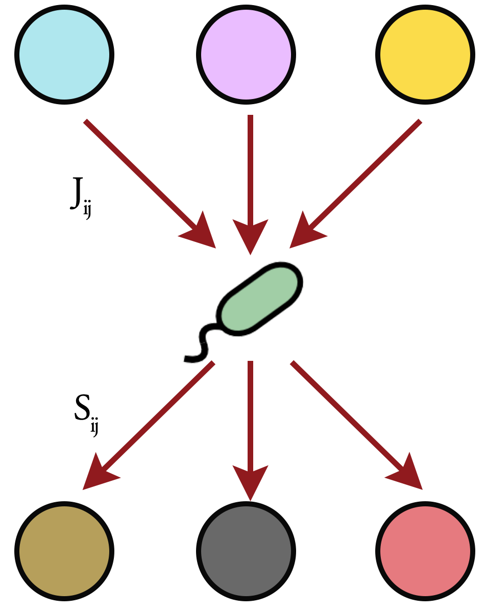

### Two matrices!

Consume chemicals from **$J_{ij}$** to reproduce

Secrete chemicals from **$S_{ij}$**

$S_{ij}$ and $J_{ij}$ are **sparse**!

---

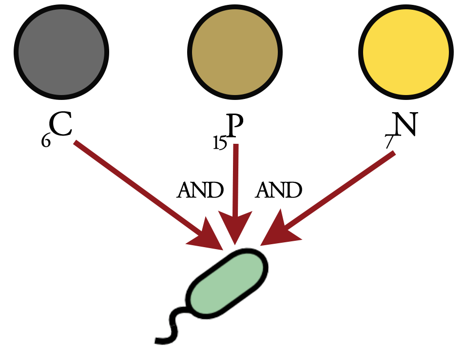

### 'AND' model

- Each species needs **2** chemicals to reproduce!

- Each species also secretes 2

- You **cannot** secrete what you need!

---

200 species, 50 chemicals

---

200 species, 70 chemicals

---

200 species, 100 chemicals

---

For 200 species:

- 50 chemicals: **Fixed point**
  - Many survive! (~100+)
- 70 chemicals: **Switching**
  - Fewer survive (~20)
- 90 chemicals: **Chaos**
  - Almost none survive (~10)

**Lack of resource variety drives diversity??!!**

---

### "Emergent Simplicity"

$\\$

Inspired by **Mikhail Tikhonov**, Washington University St. Louis.

---

Coarse-graining makes things look **simpler!**

$\\$

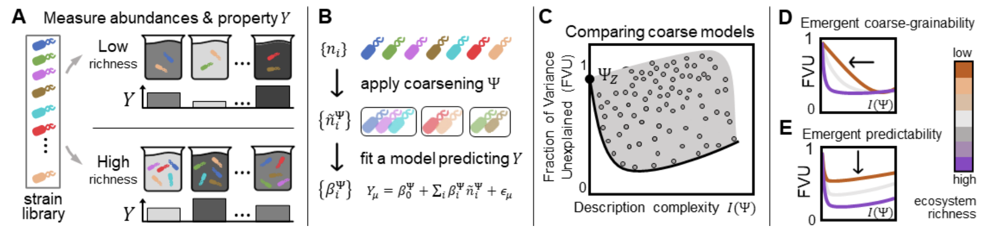

---

### Coarse-graining Mean-Field?

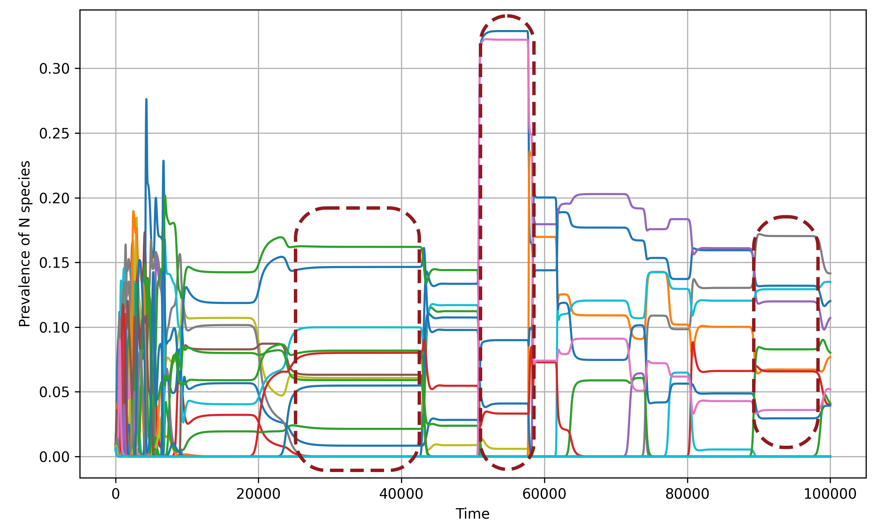

Reindex matrix by abundances, and look for patterns!

---

### Coarse-graining Lattice?

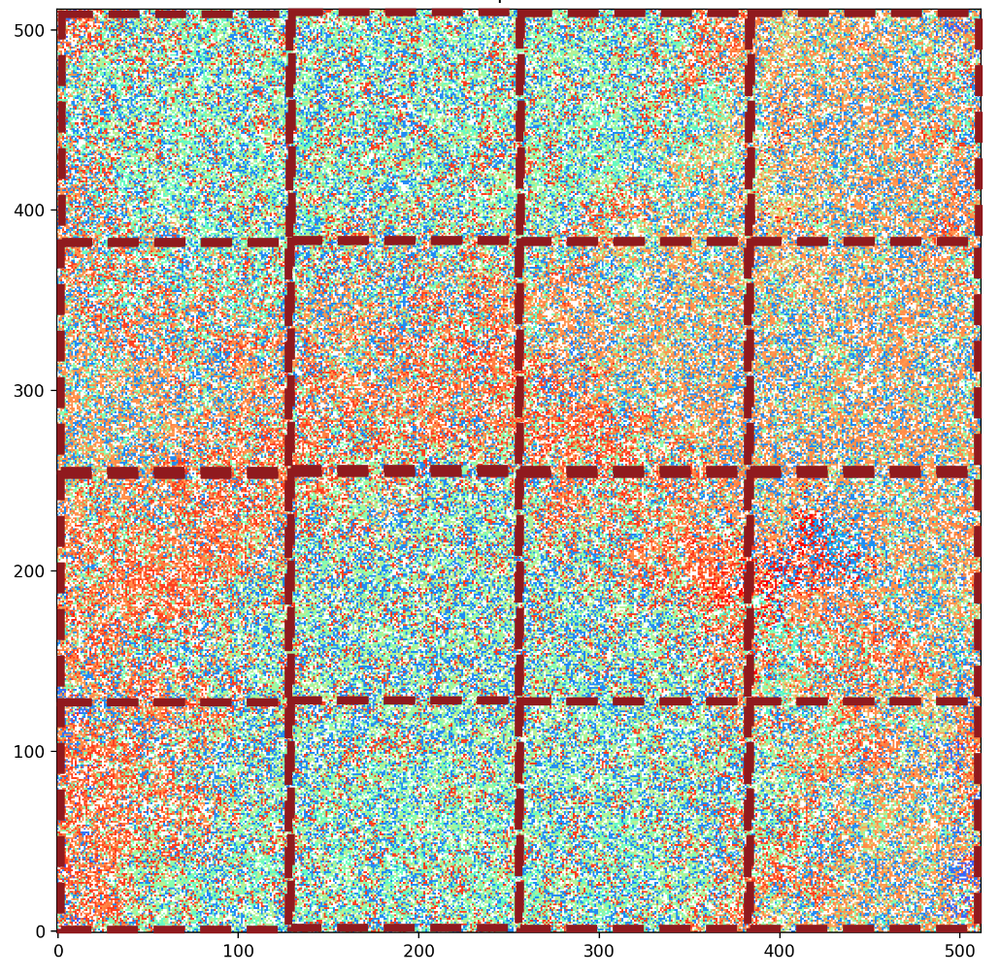

- Divide into sectors
 
- Each sector is it's own ecosystem
 
- Low dimensional manifold?

---

## Conclusion

- Multi-species modelling is arbitrary!

- More work needed!

  - Check coarse-graining

  - Evolve $J_{ij}$?

  - Introduce new species?
